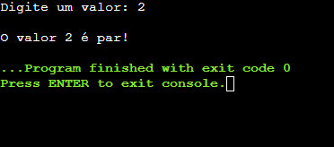
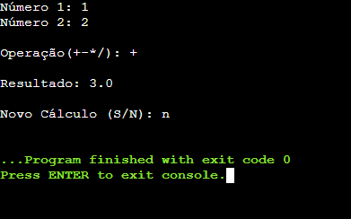

# Lógica de programação

Olá! 👋

Este repositório traz consigo todos os códigos feitos em sala de aula na matéria Algoritmos e Lógica de Programação do IFSP (Instituto Federal de São Paulo).

## Linguagem utilizada

**C**.

## Funcionalidades

Algumas das funcionalidades criadas são: 

- Análise combinatória;
- Preenchimento e navegação por vetores e matrizes ;
- Somatório;
- Etc.

## Screenshots

